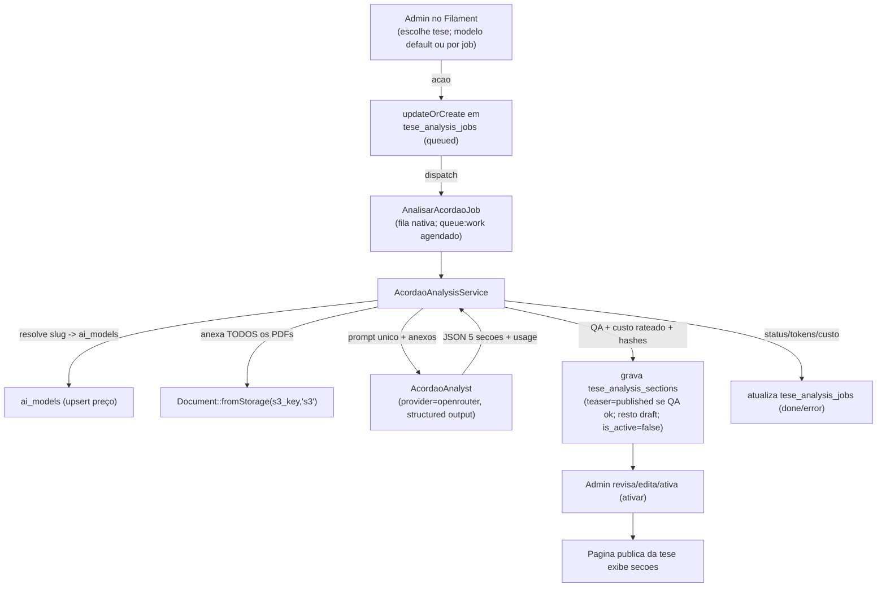

# Migração: "Decifrando a Tese" — do script Python para o Laravel 12 / Filament

> **Documento único de migração (revisado).** Descreve como levar TODA a funcionalidade do script Python `tesacordaos_ia` (`/Users/maurolopes/pythonSites/tesacordaos_ia`) para o Laravel 12 do **tesesesumulas.com.br** (`/Users/maurolopes/phpSites/teses`), de modo que a geração das análises de acórdãos ("Decifrando a Tese") passe a ser **disparada e administrada inteiramente pelo Filament admin** (`/admin/painel`), via web. Ao fim, o script Python é **desativado**.
>
> **Objetivo de paridade:** num primeiro momento, **emular fielmente o que o script Python faz, inclusive a interface web (Flask)** — tarefa **exclusiva do admin**. A interface do visitante/usuário do site **já está pronta** e não será alterada (salvo a decisão da Fase 7).
>
> Este documento já incorpora as decisões tomadas com o usuário (ver §2). A última seção (§14) traz o prompt jurídico pronto para semear.

---

## 1. Contexto e objetivo

Hoje a feature funciona em **dois lugares**:

- **Laravel**: apenas (a) **enfileira** (`POST /tese/{tribunal}/{tese_id}/resumir-ia` → `TesePageController@enqueueAi`, cria `tese_analysis_jobs` com `section_type='all'`) e (b) **lê/exibe** as seções de `tese_analysis_sections` na página pública (mostra a versão mais recente por `generated_at`, hoje **ignorando** `is_active/status`).
- **Script Python**: é quem **gera de fato** — worker baixa o PDF do S3, extrai texto (PyMuPDF + OCR Tesseract), chama a IA, valida (QA), calcula custo e grava as seções no MySQL. Tem ainda uma **interface web Flask** (admin) com 6 telas.

**Migração:** reimplementar a geração no Laravel com o **Laravel AI SDK** (`laravel/ai` v0.7.2, já instalado e em uso no chat de estatísticas), disparo e administração 100% no **Filament**, **emulando a interface Flask**. O PDF vai **direto ao modelo como anexo multimodal**, eliminando extração de texto, OCR e compressão.

**Stack alvo:** PHP 8.3 · Laravel 12 · Filament 4 · `laravel/ai` v0.7.2 · MySQL (prod) / SQLite (testes) · Pest 3 · Pint 1. Convenções obrigatórias em `AGENTS.md` / `CLAUDE.md`.

---

## 2. Decisões travadas (não reabrir)

Estas decisões foram confirmadas com o usuário e são a base do roadmap:

1. **Provider: somente OpenRouter.** Toda chamada usa `provider() = 'openrouter'`. Aproveita a mesma conta/credencial do chat e o **contador de crédito residual** já existente na página `AiSettings`. Não usaremos providers nativos (OpenAI/Anthropic/Gemini diretos).
2. **Escolha de modelo: catálogo OpenRouter completo** (igual ao select do chat), exposto num **card novo "Análise de Acórdãos"** dentro da página existente `AiSettings` (`/admin/painel/configuracoes-ia`). **Sem página de settings nova.** O modelo default fica em `SiteSetting('acordao_analysis_model')` (o **slug** OpenRouter, ex.: `anthropic/claude-sonnet-4`). **Confirmado com o usuário:** modelo default = **Claude Sonnet 4.6** (slug exato a validar contra o catálogo ao vivo na Fase 0.2); o **select deve filtrar apenas modelos PDF-capable** (`architecture.input_modalities` contém `file`).
3. **FK de custo via upsert em `ai_models`.** Como `tese_analysis_jobs.ai_model_id` e `tese_analysis_sections.ai_model_id` são **NOT NULL** (FK → `ai_models`), o slug escolhido é resolvido **sob demanda** para uma linha `ai_models` (`firstOrCreate` por `provider='openrouter' + model_id=slug`), puxando **nome e preços por 1M** do catálogo OpenRouter. Cálculo de custo segue via `AiModel::calculateCost()` (paridade com o Python). **Requer** migration aditiva para incluir `openrouter` no enum `ai_models.provider`.
4. **PDF como anexo multimodal, todos os PDFs sempre.** Confirmado no código: o Python gera as 5 seções num **único prompt** com **todos** os acórdãos da tese (a função `filter_acordaos_for_section`/`ACORDAO_TYPES_BY_SECTION` existe no `config.py` mas é **código morto** — não é usada). Anexo via `Laravel\Ai\Files\Document::fromStorage($acordao->s3_key, 's3')`, que o gateway OpenRouter **embute inline em base64** (`type: 'file'`) — validado no SDK; **não** usa a Files API (que não suporta OpenRouter).
5. **Fila nativa do Laravel.** O `queue:work --stop-when-empty` já roda **a cada minuto** pelo scheduler (`app/Console/Kernel.php`) — é o "worker". **Sem botão de worker** na UI (latência de até ~1 min após enfileirar é aceitável). `tese_analysis_jobs` segue como registro de status visível ao admin.
6. **Prompt editável sem histórico.** Reaproveitar o `AiPromptResource` (1 versão por `key`). Semear `acordao_analysis_system` via `AiPromptsSeeder` (idempotente), com **fallback em constante** na classe do agente (padrão `StatsAnalyst`). **Não** replicar o histórico de versões do Python.
7. **Idempotência por hash dos PDFs.** `source_hash` passa a ser SHA-256 da concatenação ordenada dos **`checksum`** dos acórdãos (não mais do texto extraído). Aceito que **seções antigas geradas pelo Python serão regeradas** ao reprocessar (os hashes não casam com o esquema antigo baseado em texto).
8. **QA idêntica ao Python** (constantes em §9): teaser aprovado → `published`; **demais seções sempre `draft`** (QA só registra aviso); `is_active` sempre `false` (ativação é ação manual do admin).
9. **Escopo da UI: núcleo primeiro (`core_first`).** Ordem: temas → enfileirar/detalhe → fila → revisão/ativação → prompts → **dashboard de custos por último**.
10. **Exibição no front:** decisão adiada para a **Fase 7** (manter paridade "visível ao gerar" vs. endurecer para `is_active=true`).

---

## 3. Paridade — o que o script Python faz hoje (confirmado no código)

| Capacidade | Python | Destino no Laravel |
|---|---|---|
| Geração das 5 seções num **único prompt JSON**, com **todos os PDFs** | `process_job` + `prompts/analise_completa.txt` | `AcordaoAnalyst` (structured output) + `AcordaoAnalysisService` |
| Fila com claim atômico (`FOR UPDATE SKIP LOCKED`), retry, recuperação de travados | `main.py` (`worker_loop`, `claim_job`, `recover_stale_jobs`) + `db.py` | Fila nativa + `AnalisarAcordaoJob` + `tese_analysis_jobs` (status) |
| Multi-provider | `providers/*.py` | `laravel/ai` — **somente OpenRouter** |
| Download de PDF do S3 (404 permanente vs timeout retry) | `s3.py` | `Document::fromStorage(s3_key,'s3')`; ausência → erro permanente |
| Extração de texto + OCR + compressão | `extractor.py`, `ocr_tesseract.py`, `compress_all_acordaos` | **Removido** (PDF como anexo) |
| Idempotência por hashes | `db.py` (`section_exists`, `compute_*_hash`) | `AcordaoAnalysisService` (`source_hash` via `checksum`) |
| QA (limites, frases proibidas, regra do teaser) | `qa.py` | `app/Support/SectionQa.php` |
| Custo por tokens (rateado entre seções) | `cost.py` + `process_job` | `$response->usage` + `AiModel::calculateCost()` |
| Teaser→`published`; demais→`draft`; `is_active=false` | `process_job` + `save_section` | `AcordaoAnalysisService` + `SectionQa` |
| Snapshots de preço e `raw_usage` | `save_section` | `tese_analysis_sections` |
| Enfileirar single / range / todos / `--force` | `enqueue`, `populate_queue.py`, UI Flask | Ações no Filament |
| Interface web admin (6 telas) | `app.py` + `templates/` | Filament (§11) |

**Fluxo real do `process_job` (paridade):**
1. Carrega tese (STF/STJ) e **todos** os acórdãos (`deleted_at IS NULL`, ordenados Principal→demais por id).
2. `source_hash` e `prompt_hash`; verifica idempotência por seção; se todas existem → `done` **sem custo**.
3. Monta **um** prompt (placeholders `{tema}`, `{tribunal}`, `{texto_tema}`, `{texto_tese}`; os acórdãos vão como anexo) e chama a IA **uma vez** (structured output).
4. Se o JSON traz campo `erro` preenchido → **erro permanente** (sem retry).
5. Extrai usage; **rateia** tokens/custo entre as seções geradas; grava cada seção (teaser com QA→`published`/`draft`; demais sempre `draft`; vazias são puladas).
6. Marca o job `done` com tokens/custo totais.

**Erros — permanente (sem retry) vs. retryável (incrementa `attempts` até `max_attempts`):**
- Permanente: tese/modelo/acórdão inexistente, modelo descontinuado, PDF ausente no S3, JSON inválido, campo `erro` da IA.
- Retryável: rede/timeout/rate limit. `recover_stale_jobs`: `running` há > 60 min volta para `queued` (ou `error` se esgotou tentativas).

---

## 4. Estado atual do Laravel — reaproveitar

### Tabelas que JÁ EXISTEM (não recriar)
- `ai_models` — catálogo. Enum `provider` = `('openai','anthropic','google')` → **estender com `openrouter`** (Fase 0). Model `AiModel` (`scopeActive`, `calculateCost`).
- `tese_acordaos` — PDFs no S3. `checksum` (SHA-256) já existe → base do `source_hash`. Accessor `presigned_url`, scopes `forTese`/`ofType`.
- `tese_analysis_sections` — seções. `generated_at` como `CREATED_AT`, `$timestamps=false`, `ativar($userId)` (só publica `published`), coluna gerada `active_key` + unique (1 ativa por tipo). Já tem `prompt_key/prompt_hash/source_hash/tokens_*/cost_usd/price_snapshot_*/raw_usage/...`.
- `tese_analysis_jobs` — status/fila. **Já tem** `input_tokens`, `output_tokens`, `cost_usd`. Unique `(tese_id, tribunal, section_type)`. `canRetry()`.

### Código que JÁ EXISTE (seguir o padrão / estender)
- `app/Ai/Agents/StatsAnalyst.php` — **referência** de agente: `Promptable`, `instructions()` (lê `AiPrompt` + fallback), `provider()='openrouter'`, `model()` de `SiteSetting`, `timeout()`, `maxSteps()`.
- `app/Models/AiPrompt.php` + `AiPromptResource` + `AiPromptsSeeder` (idempotente, `firstOrCreate` por `key`).
- `app/Filament/Pages/AiSettings.php` — página `/admin/painel/configuracoes-ia` com card "Crédito OpenRouter" (usa `OpenRouterManagementService::remainingCredits()`) e card "Modelo de chat" (Select de `OpenRouterManagementService::availableModels()`).
- `app/Services/Ai/OpenRouterManagementService.php` — `availableModels()` (`[slug => rótulo]`, filtra modelos de texto, preços via `pricing.prompt`/`pricing.completion`), `remainingCredits()`, `clearModelsCache()`. **Estender** com método que exponha **preço por 1M por slug** (para o upsert em `ai_models`).
- `TesePageController@enqueueAi` (admin-only) e exibição das seções no front.
- `Storage::disk('s3')` configurado.

### O que CRIAR
- `app/Ai/Agents/AcordaoAnalyst.php`, `app/Services/Ai/AcordaoAnalysisService.php`, `app/Support/SectionQa.php`, `app/Jobs/AnalisarAcordaoJob.php`.
- Filament: recursos/telas (temas elegíveis, detalhe, fila/monitor, revisão+ativação, dashboard de custos) + card em `AiSettings`.
- Seeder do prompt `acordao_analysis_system`; método de preços no `OpenRouterManagementService`.

---

## 5. Arquitetura alvo (fluxo)



---

## 6. Modelo e custo (OpenRouter-only)

- **`AcordaoAnalyst::provider()`** retorna sempre `'openrouter'`. **`model()`** lê o slug: por job (`tese_analysis_jobs.ai_model_id` → `ai_models.model_id`) ou, no disparo, do default `SiteSetting('acordao_analysis_model')`. Override por chamada permitido (`prompt($texto, $anexos, model: $slug)`).
- **Resolução de modelo → `ai_models`:** `AcordaoAnalysisService` (e a ação de enfileirar) resolvem o slug para uma linha `ai_models` via `firstOrCreate(['provider'=>'openrouter','model_id'=>$slug], ['name'=>..., 'price_input_per_million'=>..., 'price_output_per_million'=>..., 'is_active'=>true])`, com nome/preços do catálogo OpenRouter (novo método no `OpenRouterManagementService`). Esse `ai_models.id` alimenta o FK do job/seção e o `calculateCost()`.
- **Custo/usage:** `$response->usage->promptTokens` (input) e `->completionTokens` (output) — camelCase, já é a soma em multi-step. Custo via `AiModel::calculateCost($in,$out)`. Gravar em `tese_analysis_sections`: `tokens_input/output`, `cost_usd`, `price_snapshot_input/output`, `raw_usage`, `provider_request_id`, `latency_ms`, `finish_reason` (o que o SDK expuser). **Ratear** tokens/custo entre as seções geradas (prompt único gera as 5).
- **Modelo default recomendado (a confirmar contra o catálogo ao vivo na Fase 0):** Claude Sonnet via OpenRouter (ex.: `anthropic/claude-sonnet-4`), com Gemini 2.5 Pro/Flash como alternativas. **Atenção PDF:** o select pode (opcional, recomendado) filtrar modelos cujo `architecture.input_modalities` inclua `file`; caso contrário, deixar `helperText` orientando escolher modelo multimodal/PDF.
- **Config gap:** o card de análise usa o catálogo OpenRouter (já funcional para o chat). Nenhuma chave nova necessária. O contador de crédito residual já está na página.

---

## 7. Componentes Laravel a criar (detalhe)

### `app/Ai/Agents/AcordaoAnalyst.php`
- `implements Agent, HasStructuredOutput`; `use Promptable`.
- `const SYSTEM_PROMPT_KEY = 'acordao_analysis_system'`.
- `instructions()`: `AiPrompt::contentForKey(...)` com fallback `defaultInstructions()` (texto §14). Substituir placeholders (`{tema}`, `{tribunal}`, `{texto_tema}`, `{texto_tese}`) **antes** de enviar (a substituição pode ficar no Service, que monta o prompt do usuário; o system prompt pode conter as regras fixas).
- `schema(JsonSchema $schema): array` → `['erro' => $schema->string()->nullable(), 'teaser' => $schema->string()->required(), 'caso_fatico' => ..., 'contornos_juridicos' => ..., 'modulacao' => ..., 'tese_explicada' => $schema->string()->required()]`.
- `provider()` = `'openrouter'`; `model()` = slug (job/default). `timeout()`, `maxSteps()` no padrão do `StatsAnalyst`. **Usar `prompt()`** (structured output não suporta `stream()`).

### `app/Services/Ai/AcordaoAnalysisService.php`
- Carrega tese (STF/STJ via `stf_teses`/`stj_teses`; colunas diferentes: STF `tema_texto`, STJ `tema`) e acórdãos (`TeseAcordao::forTese(...)->whereNull('deleted_at')`, Principal→demais por id).
- Anexos: **todos** os PDFs via `Document::fromStorage($acordao->s3_key, 's3')`.
- `prompt_hash` = SHA-256 do conteúdo do prompt; `source_hash` = SHA-256 da concatenação ordenada dos `checksum` (Principal primeiro, depois id ASC).
- Idempotência: pular seção com mesmos (`tese_id, tribunal, section_type, source_hash, prompt_hash, ai_model_id`). Se todas existem → `done` sem custo.
- Chama `AcordaoAnalyst::make()->prompt($texto, $anexos)`; trata `$response->structured['erro']` (permanente); roda `SectionQa`; rateia custo; grava seções (`is_active=false`).

### `app/Support/SectionQa.php`
- Porte exato de `qa.py` (§9), com testes por regra.

### `app/Jobs/AnalisarAcordaoJob.php`
- Recebe `(tese_id, tribunal, section_type='all', ai_model_id?)`.
- Marca `tese_analysis_jobs` `running` (com `locked_by`), chama o Service, marca `done` (tokens/custo) ou trata erro permanente vs. retryável (incrementa `attempts`, volta a `queued` até `max_attempts`). `$tries`/`backoff` alinhados a `max_attempts`. Idempotente quanto ao registro de status.

### Filament — ver §11.

### Seeders / serviços
- `AiPromptsSeeder`: semear `acordao_analysis_system` (§14).
- `OpenRouterManagementService`: novo método `modelPricingPerMillion(string $slug): ?array{input,output}` (e/ou `modelMeta`) para o upsert em `ai_models`.

---

## 8. Idempotência

- `prompt_hash` = SHA-256 do conteúdo atual do prompt (AiPrompt ou fallback).
- `source_hash` = SHA-256 da concatenação dos `checksum` dos acórdãos, ordenados (Principal, depois id ASC).
- Skip por `(tese_id, tribunal, section_type, source_hash, prompt_hash, ai_model_id)`. Todas existem → `done` sem custo.
- "Forçar" = re-enfileira ignorando seções antigas (gera nova versão; `generated_at` mais recente).

---

## 9. QA e regras de publicação (porte exato de `qa.py`)

- **Limites por seção (caracteres):** teaser 200–1200; caso_fatico 600–4000; contornos_juridicos 800–6000; modulacao 60–2500; tese_explicada 800–5000.
- **Frases proibidas:** "como IA", "como modelo de linguagem", "não tenho acesso", "não posso acessar", "baseado no texto fornecido", "como assistente", "como uma IA", "não possuo acesso", "não é possível acessar".
- **Frases padrão de modulação** (permitidas abaixo do mínimo): "Não houve modulação de efeitos neste julgamento." / "O acórdão não aborda modulação de efeitos."
- **Frase de informação ausente** (permitida abaixo do mínimo, se presente): "Não consta informação suficiente no acórdão."
- **Teaser** (`validar_teaser`): além de limites e frases, precisa mencionar tribunal/tema (`STF`/`STJ`, `Tema N`, `repercussão geral` ou `recursos repetitivos`). Passou → `status='published'`; senão → `draft`.
- **Demais seções** (`validar_secao`): falha de QA **não bloqueia** a gravação; apenas registra aviso e mantém `draft`.
- **`is_active` sempre `false`** na gravação. Seção vazia no JSON → pulada (não grava).

---

## 10. Custo e usage

- Tokens: `$response->usage->promptTokens` / `->completionTokens`.
- Custo: `AiModel::calculateCost($in,$out)` (preços por 1M na linha `ai_models` resolvida do slug).
- Rateio entre as seções geradas; total no job (`input_tokens`, `output_tokens`, `cost_usd`).
- Dashboard de custos (Fase 9): agregar por modelo deduplicando a requisição única que gerou as 5 seções — usar `provider_request_id` ou `generated_at` truncado ao minuto (espelha `get_model_costs` do Python).

---

## 11. Interface Filament a emular (telas Flask → Filament)

Ordem de implementação **core_first**. Cada tela que mexe em UI exige **validação manual do usuário**.

1. **Card "Análise de Acórdãos" em `AiSettings`** (`/admin/painel/configuracoes-ia`): Select do catálogo OpenRouter → `SiteSetting('acordao_analysis_model')`. (Equivale ao "modelo default" das telas Flask.)
2. **Temas elegíveis** (`/temas` do Flask): tabela de teses STF/STJ com acórdãos. Filtros: tribunal, tem-IA (`has_ai`), **somente trânsito em julgado** (`situacao LIKE '%Trânsito%'`), ordenação (número/qtd. acórdãos), paginação. Colunas: tribunal, nº tema, descrição, nº acórdãos, status da fila, tem-IA. Ações: **Analisar com IA** (single, `updateOrCreate` job + `dispatch`), **Forçar reprocesso**, **lote** (enfileirar/retirar da fila os da página atual; "elegível" = sem seções e sem job queued/running).
3. **Detalhe do tema** (`/tema/<tribunal>/<id>` do Flask): tese + acórdãos (com `presigned_url`) + seções geradas (status/custo) + jobs recentes. Ação de enfileirar single com escolha de modelo e `force`.
4. **Fila / monitor** (`/fila` + `/` do Flask): `tese_analysis_jobs` com filtros por status, tentativas, último erro, custo. Ações: **recuperar travados** (`recover_stale_jobs`, >60min), **remover job** (só `queued`), **purgar** (`done`/`error`/ambos), **aplicar modelo aos `queued`** (`update_queued_jobs_model`). **Sem** botão de worker (scheduler cobre).
5. **Revisão e ativação de seções**: ver/editar conteúdo, ver status/custo; promover `draft → published` (necessário para `ativar()`), e `ativar()` (marca `is_active`, desativa anteriores via unique `active_key`).
6. **Prompts**: reaproveitar `AiPromptResource` (editar `acordao_analysis_system`). Sem histórico de versões.
7. **Dashboard de custos** (`/` do Flask) — **por último**: stats de jobs por status + custo agregado por modelo (§10).

> **Navegação:** agrupar sob um grupo Filament dedicado (ex.: "Decifrando a Tese"), exceto o card de modelo (fica em "Configurações"/`AiSettings`) e os prompts (já em "Configurações").

---

## 12. Roadmap de implementação em baby steps

> **Regras de workflow (obrigatórias):**
> - Avançar **um passo por vez**.
> - **Gate de validação** antes de seguir: testes Pest verdes do escopo do passo + `vendor/bin/pint --dirty --format agent`.
> - Passo que mexe em **frontend/Filament UI** → **PARAR e pedir validação manual do usuário** (checagem visual) antes de prosseguir.
> - Só avançar após validação **e** marcar `[x]` aqui.
> - **Commit somente com autorização explícita do usuário.** Ao fim de cada passo validado, perguntar se pode commitar (mensagem no padrão do repo).

### Fase 0 — Fundação (sem UI)
- [x] **0.1** Migration aditiva: incluir `openrouter` no enum `ai_models.provider` (`MODIFY COLUMN`, preservando os existentes). _Gate:_ `migrate` em SQLite + teste que insere `ai_models` com `provider='openrouter'`. _(Colunas de custo em `tese_analysis_jobs` já existem — nada a fazer.)_
- [x] **0.2** `OpenRouterManagementService::modelPricingPerMillion(string $slug)` (e helper de nome) lendo o catálogo (`pricing.prompt/completion` → por 1M), cacheado. _Gate:_ teste com HTTP fake do catálogo OpenRouter. _(Slug do default confirmado no catálogo ao vivo: `anthropic/claude-sonnet-4.6`, $3/M in · $15/M out, PDF-capable.)_
- [x] **0.3** Helper de resolução slug → `ai_models` (`firstOrCreate` por `provider+model_id`, com nome/preços do catálogo). _Gate:_ teste (cria linha nova; reusa existente; atualiza preço se mudou — definir política). _(Política confirmada: **atualizar** nome e preços no upsert; `is_active` e nome existentes são preservados quando o catálogo está indisponível. Classe `App\Services\Ai\AiModelResolver::resolveOpenRouterModel()`.)_
- [x] **0.4** Semear `acordao_analysis_system` em `ai_prompts` via `AiPromptsSeeder` (§14). _Gate:_ teste `AiPrompt::contentForKey(...)` não vazio + idempotência (2x não duplica). _(Texto inline no seeder por ora; na Fase 1.1 será movido para `AcordaoAnalyst::defaultInstructions()` e o seeder passará a referenciá-lo, como no `StatsAnalyst`.)_
- [x] **0.5** Definir `SiteSetting('acordao_analysis_model')` (leitura/escrita). _Gate:_ teste de leitura/escrita. _(Default em `config('ai.acordao_analysis.default_model')` = `anthropic/claude-sonnet-4.6`, fallback robusto sem seed manual; leitura via `SiteSetting::get('acordao_analysis_model', config(...))`.)_

### Fase 0b — Card de modelo na `AiSettings` (UI)
- [x] **0b.1** Card "Análise de Acórdãos" em `AiSettings`: Select do catálogo OpenRouter (igual ao do chat) → persiste `acordao_analysis_model`. _Gate:_ teste Filament (render + save) **+ validação manual** (`/admin/painel/configuracoes-ia`). _(Select filtra PDF-capable; default `anthropic/claude-sonnet-4.6`; validação manual OK.)_

### Fase 1 — Agente IA
- [ ] **1.1** `AcordaoAnalyst` (`Agent` + `HasStructuredOutput`; `instructions()` + fallback; `schema()` erro + 5 seções; `provider()='openrouter'`; `model()` dinâmico). _Gate:_ teste com `AcordaoAnalyst::fake([...])` validando `$response->structured` (5 chaves + `erro`) e modelo resolvido.

### Fase 2 — QA
- [ ] **2.1** `app/Support/SectionQa.php` (porte de `qa.py`). _Gate:_ testes unitários por regra (limites mín/máx por seção, cada frase proibida, frases padrão de modulação, frase de info ausente, menção a tribunal/tema no teaser, teaser→published).

### Fase 3 — Service (idempotência, anexos, custo)
- [ ] **3.1** `AcordaoAnalysisService` (carrega tese+acórdãos, anexa todos os PDFs, hashes, resolve modelo, chama agente, trata `erro`, QA, custo rateado, grava seções). _Gate:_ testes com `AcordaoAnalyst::fake` + `Storage::fake('s3')`: gera 5 seções (teaser published, resto draft, `is_active=false`), grava tokens/custo/snapshots/`raw_usage`; idempotência pula seção existente (→ `done` sem custo); campo `erro` vira erro permanente; seção vazia é pulada.

### Fase 4 — Job na fila
- [ ] **4.1** `AnalisarAcordaoJob` (status em `tese_analysis_jobs` running→done/error; retryável vs permanente; `max_attempts`). _Gate:_ testes (sucesso marca done com métricas; permanente marca error sem retry; retryável re-enfileira; todas seções já existentes → done sem custo).

### Fase 5 — Disparo no Filament (UI) + browser de temas
- [ ] **5.1** Tela "Temas elegíveis" (filtros tribunal/tem-IA/trânsito/ordenação + paginação) com ações Analisar/Forçar/lote (`updateOrCreate` job + `dispatch`; `Queue::fake` nos testes). _Gate:_ teste Filament **+ validação manual**.
- [ ] **5.2** Detalhe do tema (acórdãos + seções + jobs; enfileirar single com modelo/force). _Gate:_ teste Filament **+ validação manual**.
- [ ] **5.3** (Opcional) Alinhar `TesePageController@enqueueAi` para também `dispatch(AnalisarAcordaoJob)` (botão "Resumir com IA" ponta a ponta). _Gate:_ teste de rota **+ validação manual**.

### Fase 6 — Fila / monitor (UI)
- [ ] **6.1** Tela de `tese_analysis_jobs` (filtros por status/tentativas/erro/custo) com ações recuperar travados, remover job (queued), purgar (done/error/ambos), aplicar modelo aos queued. _Gate:_ teste Filament **+ validação manual**.

### Fase 7 — Revisão e ativação de seções (UI)
- [ ] **7.0** Decidir exibição no front (§2.10): manter "visível ao gerar" (paridade) ou exibir só `is_active=true` (ativação vira gate real; nesse caso, promover `draft→published` antes de `ativar()` e ajustar `TesePageController`). _Gate:_ alinhamento com o usuário.
- [ ] **7.1** Revisão das seções (ver/editar conteúdo, status/custo); promover `draft→published`; `ativar()` (marca `is_active`, desativa anteriores). _Gate:_ teste Filament **+ validação manual** (conferir exibição na página pública).

### Fase 8 — Validação ponta a ponta
- [ ] **8.1** Rodar pelo site: enfileirar → gerar → revisar → ativar → ver no front, em amostra STF e STJ (incluindo um PDF escaneado, para validar o multimodal sem OCR). _Gate:_ **validação manual** + paridade de resultados.

### Fase 9 — Dashboard de custos (UI) + corte do Python
- [ ] **9.1** Dashboard: stats por status + custo agregado por modelo (deduplicando a requisição única). _Gate:_ teste **+ validação manual**.
- [ ] **9.2** Parar workers Python em produção (sem novos enfileiramentos pelo Python).
- [ ] **9.3** Aposentar/arquivar o repositório Python. _Gate:_ confirmação do usuário.

---

## 13. Checklist de paridade (antes de desativar o Python)

- [ ] 5 seções com o mesmo prompt e regras (anonimização, CPC/73, evergreen, anti-alucinação, JSON estrito, campo `erro`).
- [ ] Idempotência por hashes (pula repetida; job `done` sem custo).
- [ ] QA (teaser→published; demais→draft; `is_active=false`).
- [ ] Custo/tokens por seção (snapshots + `raw_usage`) e total no job.
- [ ] PDF escaneado tratado via multimodal (sem OCR).
- [ ] Fila com status, retry e recuperação de travados.
- [ ] Disparo single/lote/forçar pela web; modelo default e edição de prompt no Filament.
- [ ] Telas equivalentes às do Flask (temas, detalhe, fila, revisão/ativação, prompts, dashboard).

---

## 14. PROMPT a semear em `ai_prompts` (key: `acordao_analysis_system`)

> Placeholders substituídos em runtime: `{tema}`, `{tribunal}`, `{texto_tema}`, `{texto_tese}`. Os acórdãos vão como **anexo (PDF)** — a frase final do Python ("ACÓRDÃOS: {texto}") é adaptada para indicar que os acórdãos seguem anexados. Preservar TODAS as regras.

```text
Você é um especialista jurídico brasileiro.

TAREFA: Analisar o conjunto de acórdãos do Tema {tema} do {tribunal} (anexados a esta solicitação como PDF) e extrair as informações abaixo.

IMPORTANTE:
- O texto pode incluir acórdão principal, embargos de declaração, acórdão específico de modulação e acórdão de revisão de tese.
- Se houver divergência entre acórdãos, priorize o mais recente na seguinte ordem: Revisão de Tese > Modulação > Embargos > Principal.
- Se houver revisão de tese, a síntese deve refletir o entendimento vigente e mencionar que houve revisão.
- O texto deve ser evergreen, portanto, evite ao máximo possível menções à conjuntura atual. Exemplo do que evitar: "Em momentos em que a SELIC está elevada, como o cenário atual...". Quando a SELIC baixar, o texto ficará sem sentido.
- O texto que você apresentar na resposta será o texto final, a ser imediatamente publicado na web aos usuários do site Teses e Súmulas; portanto, não formule questionamentos como se estivesse em um chat e pudesse apresentar uma nova resposta, tampouco ofereça indícios de que você é uma IA ou de que o seu trabalho resulta de um processo automatizado. Não diga algo como "não há dados no material fornecido ...". Comporte-se como um consultor jurídico. Caso não possa fornecer o texto final, por qualquer motivo, acuse o erro, indicando o motivo.
- Se for mencionado no acordão o CPC (Código de Processo Civil) de 1973, hoje já revogado, referenciá-lo no resumo como "CPC/73". O CPC de 2015, atualmente em vigor, pode ser referenciado apenas como "CPC", salvo se for importante destacar, para efeitos de comparação com o antigo, o fato de ser o CPC vigente.

RETORNE EXCLUSIVAMENTE um JSON válido com a seguinte estrutura (sem texto antes ou depois):

{
  "erro": null,
  "teaser": "Resumo curto e atrativo do tema, mencionando o tribunal e o número do tema.",
  "caso_fatico": "Descrição objetiva dos fatos ou da lei questionada.",
  "contornos_juridicos": "Fundamentos jurídicos que levaram o tribunal à conclusão.",
  "modulacao": "Descrição da modulação de efeitos, se houver.",
  "tese_explicada": "Explicação didática da decisão para não especialistas."
}

REGRA DO CAMPO "erro":
- O campo "erro" deve SEMPRE estar presente no JSON.
- Se a análise for bem-sucedida, use: "erro": null
- Se NÃO for possível realizar a análise, preencha "erro" com uma string descrevendo o motivo e defina TODOS os demais campos como string vazia "".

CENÁRIOS DE ERRO (não exaustivos):
- Acórdão não corresponde ao tema solicitado (ex.: texto trata de outro tema)
- Texto ilegível, corrompido ou truncado (falta fundamentação ou voto do relator)
- Documento não é um acórdão (ex.: despacho, certidão, petição)
- Texto insuficiente para análise (ex.: apenas ementa, sem fundamentação)
- Outro motivo que impeça a extração confiável das informações

Exemplo de JSON com erro:
{
  "erro": "O texto fornecido não corresponde ao Tema 1069. O acórdão trata de matéria diversa (Tema 574).",
  "teaser": "",
  "caso_fatico": "",
  "contornos_juridicos": "",
  "modulacao": "",
  "tese_explicada": ""
}

LIMITES DE TAMANHO (em caracteres, incluindo espaços):
- teaser: mínimo 200, máximo 1200
- caso_fatico: mínimo 600, máximo 4000
- contornos_juridicos: mínimo 800, máximo 6000
- modulacao: mínimo 60, máximo 2500
- tese_explicada: mínimo 800, máximo 5000

OBSERVAÇÃO SOBRE LIMITES:
- Se a informação não constar no acórdão, esse campo pode ficar abaixo do mínimo (informe a ausência).
- As respostas fixas obrigatórias do campo "modulacao" ("Não houve modulação de efeitos neste julgamento." e "O acórdão não aborda modulação de efeitos.") podem ficar abaixo do mínimo.

REGRAS OBRIGATÓRIAS DE FORMATO (CRÍTICO PARA O SISTEMA):
- Retorne APENAS o JSON. Sem ```json, sem texto introdutório.
- Use aspas duplas (") APENAS para abrir e fechar chaves e valores do JSON.
- DENTRO do texto dos campos, use SEMPRE aspas simples (') para citações ou destaques. Exemplo: "O tribunal analisou o termo 'faturamento'..."
- NÃO use quebras de linha reais dentro das strings. Use \n\n para separar parágrafos.
- O JSON deve ser válido e parseável imediatamente.

REGRAS DE CONTEÚDO E ANTI-ALUCINAÇÃO:
- NÃO invente informações.
- Se alguma informação não constar, escreva: "Não consta informação suficiente no acórdão."
- NÃO reproduza literalmente a tese firmada, exceto se indispensável (máximo 1 frase curta).

REGRA GERAL:
- Sempre que houver menção a nome de pessoas físicas ou jurídicas, anonimize o dado, usando apenas as iniciais, salvo quando se tratar de nome de ministro ou outro julgador, caso em que poderá ser identificado. Exemplos: "Rogério Lima Vieira" deve ser referenciado como "R.L.V."; "Master Cálculo Contadores Associados Ltda" deve ser referenciado como "M.C.C.A. Ltda."
- O texto não pode sofrer defasagem temporal. Evite destacar a conjuntura atual.
- O texto será publicado diretamente na web; comporte-se como consultor jurídico; em caso de impossibilidade, acuse o erro no JSON.
- CPC de 1973 => "CPC/73"; CPC de 2015 => "CPC".

REQUISITOS ESPECÍFICOS POR CAMPO:

teaser:
- Deve mencionar o tribunal e o número do tema (ex.: "Tema 1069 do STJ").
- Linguagem profissional, direta e informativa.

caso_fatico:
- SE FOR CASO CONCRETO (RE, REsp): Descreva as partes, cronologia, valores e a origem da lide.
- SE FOR CONTROLE ABSTRATO (ADI, ADC, ADPF): Descreva a Lei/Ato Normativo questionado, quem propôs a ação e qual artigo/princípio foi alegado como violado.
- NÃO incluir análise jurídica aqui.
- Mencione processo/relator apenas aqui (uma única vez).

contornos_juridicos:
- Indicar a questão jurídica central (Ratio Decidendi).
- Indicar dispositivos legais/constitucionais citados.
- Indicar precedentes mencionados e divergências relevantes.
- Se houver revisão de tese, explicar a mudança de entendimento.

modulacao:
- Se o tribunal DECIDIU não modular: usar exatamente "Não houve modulação de efeitos neste julgamento."
- Se o acórdão NÃO ABORDA modulação (tema não foi discutido): usar exatamente "O acórdão não aborda modulação de efeitos."
- Se houve modulação: indicar marco temporal, critérios e justificativa.
- Indicar se a modulação veio em embargos ou revisão.

tese_explicada:
- Explicação acessível dos impactos práticos para contribuintes/cidadãos e para o poder público.
- Evitar jargão desnecessário.
- Se houver revisão, alertar sobre a mudança de regra.

RENOVAÇÃO DE PEDIDO IMPORTANTE: RETORNE EXCLUSIVAMENTE um JSON válido, conforme as instruções prévias.

TEMA:
{texto_tema}

TESE:
{texto_tese}

ACÓRDÃOS: seguem anexados a esta solicitação como arquivo(s) PDF.
```

---

## 15. Referências cruzadas

- Script Python: `/Users/maurolopes/pythonSites/tesacordaos_ia` (`main.py`, `db.py`, `qa.py`, `cost.py`, `s3.py`, `config.py`, `app.py`, `templates/`, `prompts/analise_completa.txt`, `prompt_db.py`).
- Doc do SDK: https://laravel.com/docs/12.x/ai-sdk (validado contra `vendor/laravel/ai` v0.7.2).
- Padrão de agente: `app/Ai/Agents/StatsAnalyst.php`. Página de settings: `app/Filament/Pages/AiSettings.php`. Catálogo/crédito: `app/Services/Ai/OpenRouterManagementService.php`.
- Briefing: `PROJECT_BRIEF.md`.
